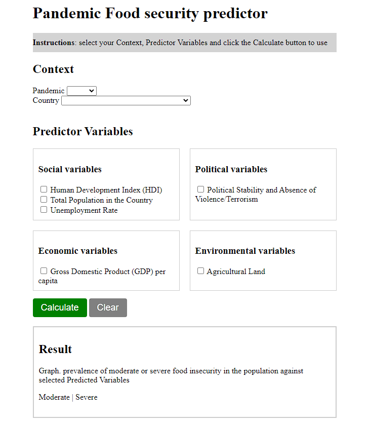
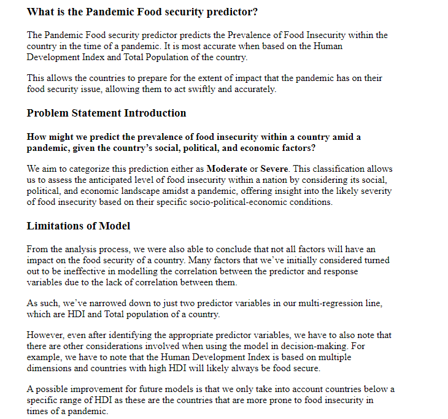
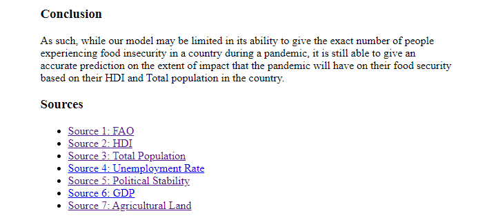

# Pandemic Food security predictor

<!-- markdown-toc start -->

**Table of Contents**

- [Pandemic Food security predictor](#Pandemic Food security predictor)
  - [Create Virtual Environment](#create-virtual-environment)
  - [Run Flask](#run-flask)
    - [Vocareum](#vocareum)
    - [Local Computer](#local-computer)
  - [Instructions for webapp](#instructions-for-webapp)
  - [Expected Input](#expected-input)
  - [Expected Output](#expected-output)
  - [Another prediction](#another-prediction)

<!-- markdown-toc end -->

## Setup

### Create Virtual Environment

**You should open Anaconda Prompt to do the following steps.**

In the following steps, whenever there is a different between the OS commands, the **Windows** prompt will be represented by:

```shell
>
```

while the MacOS/Linux prompt will be represented by:

```shell
$
```

Go to the root folder `2D_webapp`.

Windows:

```dos
> cd %USERPROFILE%\Downloads\2D_webapp
```

Unix/MacOS:

```shell
$ cd ~/Downloads/2D_webapp
```

First make sure that you have installed `pipenv` package.

```shell
python -m pip install --user pipenv
```

Install the required packages from requirements.txt:

```shell
pip install -r requirements.txt
```

**If you are running the above commands in Vocareum, you may encounter the following message at the end of the installation.**

```shell
WARNING: The script virtualenv is installed in '/voc/work/.local/bin' which is not on PATH.
Consider adding this directory to PATH or, if you prefer to suppress this warning, use --no-warn-script-location.
WARNING: The scripts pipenv and pipenv-resolver are installed in '/voc/work/.local/bin' which is not on PATH.
Consider adding this directory to PATH or, if you prefer to suppress this warning, use --no-warn-script-location.
```

It is basically saying that you need to add the newly installed `pipenv` program into the `PATH` so that you can use it from anywhere in the terminal. To do that, run the following command in the terminal.

```shell
export PATH='/voc/work/.local/bin':$PATH
```

Note: the above command works when you are running in Vocareum under Linux shell.

We will call `mp_sort` folder as the **root** folder of our application.

From the root folder, install the packages specified in the `Pipfile`.

```shell
python -m pipenv install
```

The above steps will install Flask and Transcrypt Python libraries and some other necessary packages.

To activate the virtualenv, run

```shell
python -m pipenv shell
```

Alternatively, you can choose everytime you run a command to prepend that command with the following:

```shell
python -m pipenv run
```

Ok, so let's enter into the shell by typing:

```shell
python -m pipenv shell
```

You should see the word `(2D_webapp)` in your prompt something like:

Windows:

```dos
(2D_webapp) folder >
```

Unix/MacOS:

```shell
(2D_webapp) user $
```

_To exit the virtual environment at the end of this mini project, simply type:_

```shell
exit
```

All the steps assumes you are in the virtualenv shell.

### Run Flask

Now you are ready to run your web app in your local computer. To do so, you need to go back to the root directory. This can be done with the following:

Windows:

```dos
> cd ..\..
```

Unix/MacOS:

```shell
$ cd ../..
```

which means go up the folder two times. Or, simply

Windows:

```dos
> cd %USERPROFILE\Downloads\2D_webapp
```

Unix/MacOS:

```shell
$ cd ~/Downloads/2D_webapp/
```

You should see `application.py` in this root folder.

Now, you can run Flask by typing:

```shell
flask run
```

You should see that some output will be thrown out, which one of them would be:

```shell
* Running on http://127.0.0.1:5000/ (Press CTRL+C to quit)
```

Now you can open your browser at `http://127.0.0.1:5000/` to see the web app. You should see something like the following:


To stop the web app, type `CTRL+C`.

## Instructions for webapp

select your input Context and Predictor Variables

## Expected Input

1. Select Context: Pick a pandemic and country
2. Select Predictor Variables: Select as many Predictor Variables as you like
3. Click Calculate

## Expected Output

A Result produced.

- Moderate: Our model predicts that food security in your selected {country}, given your selected {predictor variables} is highly likely to be moderately affected in selected {pandemic}.
- Severe: Our model predicts that food security in your selected {country}, given your selected {predictor variables} is highly likely to be severly affected in selected {pandemic}.

## Another prediction

please use the Clear button then repeat steps for Expected Input. Or you can manually reconfigure the Expected Inputs directly.



